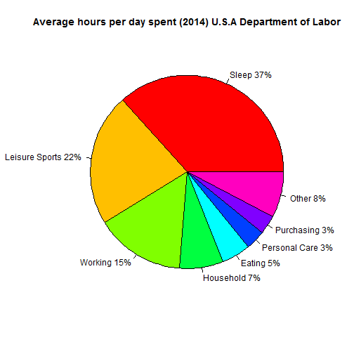

## Age Calculator

### Exactly how old are you?

It is important how you feel about your age because that will reflect how you feel

But also is so important to evaluate your past and learn for the future.

### Start counting your age not in years, but days! 

The day is the natural cycle of our lives. 

The cycle of light and dark, wakefulness and sleep, has more significance than the cycle of the seasons. 
Indeed, in equatorial latitudes, you hardly notice the passing of the seasons. 

The day is what counts.

Each day is a complete unit in itself. 

--- &radio

## Age Calculator

Let me ask you, if today you were 23 years old, how old were you in days?

1. 6574
2. 10227
3. _8400_
4. 5478

*** .hint
There are 365/366 days in a year depending of the leap years you have live

*** .explanation
Very good. You should try my age calculator.

--- 

## Age Calculator

### Why not counting your age in days?

You can hold a day's experience in mind quite easily. 

Trying to go back and take stock of a whole year is much harder!! 
Numerous incidents and discoveries are inevitably forgotten.

You also may find it far more meaningful to think that you have lived through thousand days this life, rather than years. And it reframes the future. 

You have -- probably -- thousands of days still to come. Thousands of new days to discover, enjoy and learn from. 
 
It is easy to go through our days on semi-automatic, caught up in doing and thoughts about the past and the future, not experiencing the present moment in its fullness. 

At the end of each day you can look back and take stock.
How have you been? What have you learned? What can you be grateful for? 

---

## Age Calculator
### Do you know how much time we invest in a day?

Go ahead and try my Age Calculator now https://ccortes.shinyapps.io/Project1

 
